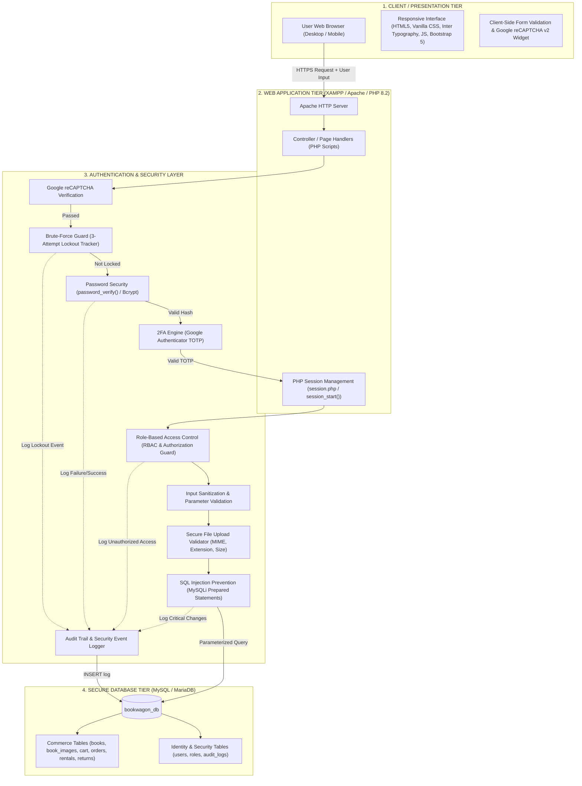
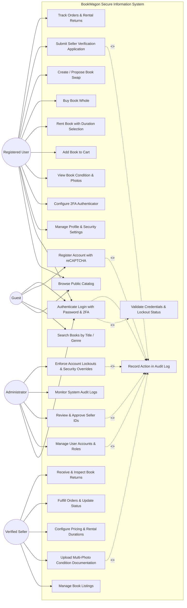
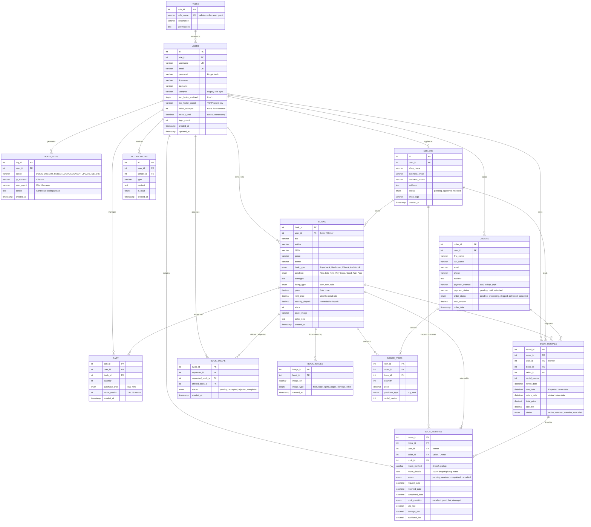

# PART III – SYSTEM DESIGN
### BookWagon: A Secure Web-Based Platform for Sustainable Book Rental and Resale
**Course:** Information Assurance and Security 2 (IAS 2)  
**Document Module:** System Architecture, Use Case Specifications, Database Design (ERD), and System Flowcharts

---

## A. System Architecture

The BookWagon system implements a **Defense-in-Depth, Multi-Tier Secure Web Architecture**. Rather than allowing direct communication between user requests and database records, every transaction and data request must cross a dedicated **Authentication and Security Enforcement Layer**.



### Architectural Layer Breakdown

1. **Client / Presentation Tier:**
   * Runs inside the client’s web browser.
   * Delivers an intuitive responsive interface using semantic HTML5, custom Vanilla CSS, and Bootstrap 5 components.
   * Performs real-time client-side checks (password confirmation, file format checks) and embeds Google reCAPTCHA v2 to stop bot submissions before reaching server bandwidth.

2. **Web Application Tier (Apache & PHP 8.2):**
   * Hosted on an Apache HTTP server (XAMPP environment).
   * Orchestrates application logic across page controllers (`login.php`, `book_details.php`, `cart.php`, `Manage_books.php`, `rental_request.php`, `history.php`, etc.).
   * Maintains user state using hardened PHP Sessions (`session_regenerate_id(true)` upon privilege changes; session guards in `session.php`).

3. **Authentication & Security Enforcement Layer (The Core IAS Layer):**
   * **Bot Mitigation:** Validates reCAPTCHA tokens against Google’s verification API.
   * **Brute-Force Protection:** Enforces a 3-consecutive-failure account lockout window.
   * **Cryptographic Defense:** Uses standard PHP `password_hash()` with `PASSWORD_BCRYPT` (cost factor 10+) and constant-time verification with `password_verify()`.
   * **Two-Factor Authentication (2FA):** Verifies 6-digit Time-based One-Time Passwords (TOTP) from Google Authenticator (`verify_2fa.php`).
   * **Role-Based Access Control (RBAC):** Restricts endpoints by verifying `$_SESSION['usertype']` (Guest, Registered User, Verified Seller, Administrator). Direct URL tampering is prevented.
   * **SQL Injection Defense:** All queries utilize parameterized queries (`prepare()`, `bind_param()`, `execute()`). Direct string concatenation is prohibited.
   * **Secure Upload Pipeline:** Validates book covers, condition photos, and identification proofs through file size caps (max 5MB), MIME type inspection (`image/jpeg`, `image/png`, `image/webp`), and randomized filenames (`uniqid()`).
   * **Audit Logging:** Logs timestamp, user ID, IP address, user-agent, action type, and status to an immutable `audit_logs` table.

4. **Database Tier (MySQL / MariaDB):**
   * Relational database engine storing persistent entities under `bookwagon_db`.
   * Enforces referential integrity through foreign keys with cascading rules.

---

## B. Use Case Diagram

The Use Case model defines the functional interactions between the four primary actors (**Guest**, **Registered User / Buyer & Renter**, **Verified Seller**, and **Administrator**) and the **BookWagon System Boundary**.



### Use Case Specification Matrix

| Use Case ID | Use Case Name | Primary Actor(s) | Pre-Conditions | Security Controls Applied |
| :--- | :--- | :--- | :--- | :--- |
| **UC-01** | **User Registration** | Guest | Guest is not logged in. | Google reCAPTCHA v2 validation, email format regex, server-side duplicate check, bcrypt password hashing. |
| **UC-02** | **Secure Login** | Guest, User, Seller, Admin | Account exists and is not locked. | Brute-force lockout check (max 3 failed tries), `password_verify()`, TOTP 2FA prompt, session fixation mitigation (`session_regenerate_id`). |
| **UC-03** | **Book Rental & Purchase** | Registered User | Authenticated with active session. | Role verification (`user`), stock check, input validation on duration (`rental_weeks`), CSRF-safe POST submission. |
| **UC-04** | **Condition Photo Documentation** | Verified Seller | Authenticated with `seller` role. | Role-Based Authorization Guard, MIME type inspection, file extension whitelist (`jpg, png, webp`), 5MB size limit. |
| **UC-05** | **Seller Verification Review** | Administrator | Authenticated with `admin` role. | Strict admin session check (`usertype === 'admin'`), audit trail recording of approval/rejection decision. |
| **UC-06** | **Security Audit Log Monitoring** | Administrator | Authenticated with `admin` role. | Read-only parameterized query, administrative authorization check, sanitized output rendering (XSS prevention). |

---

## C. Database Design

### 1. Entity Relationship Diagram (ERD)

The database design incorporates required security tables (`users`, `roles`, `audit_logs`) alongside application domain tables (`sellers`, `books`, `book_images`, `cart`, `orders`, `order_items`, `book_rentals`, `book_returns`, `book_swaps`, and `notifications`).



---

### 2. Data Dictionary (Security & Core Tables)

#### Table: `users`
*Stores user identities, cryptographic credentials, 2FA parameters, and lockout state.*

| Column Name | Data Type | Nullable | Key | Default | Security & Operational Description |
| :--- | :--- | :--- | :--- | :--- | :--- |
| `id` | `INT(11)` | No | PK, AI | Auto | Unique identifier for the user account. |
| `role_id` | `INT(11)` | Yes | FK | 3 (`user`) | References `roles(role_id)` for RBAC enforcement. |
| `username` | `VARCHAR(50)` | No | UK | None | Sanitized unique username for identification. |
| `email` | `VARCHAR(255)` | No | UK | None | Unique email address used as primary login credential. |
| `password` | `VARCHAR(255)` | No | None | None | **Bcrypt password hash** generated via `password_hash()`. Plain-text is never stored. |
| `firstname` | `VARCHAR(50)` | Yes | None | NULL | First name of the account holder. |
| `lastname` | `VARCHAR(50)` | Yes | None | NULL | Last name of the account holder. |
| `usertype` | `VARCHAR(50)` | Yes | None | `'user'` | Role name (`'admin'`, `'seller'`, `'user'`) for backward-compatible session checking. |
| `two_factor_enabled`| `TINYINT(1)` | No | None | `0` | Flag (`1` = enabled, `0` = disabled) requiring TOTP authentication. |
| `two_factor_secret` | `VARCHAR(64)` | Yes | None | NULL | Encrypted Base32 secret key shared with Google Authenticator. |
| `failed_attempts` | `INT(11)` | No | None | `0` | Counter for consecutive failed login attempts; resets to 0 upon success. |
| `lockout_until` | `DATETIME` | Yes | None | NULL | Timestamp until which login attempts are rejected (locks for 15 mins after 3 fails). |
| `login_count` | `INT(11)` | No | None | `0` | Running count of successful authentications for anomaly detection. |
| `created_at` | `TIMESTAMP` | No | None | `CURRENT_TIMESTAMP` | Audit timestamp of account creation. |
| `updated_at` | `TIMESTAMP` | No | None | `CURRENT_TIMESTAMP` | Automatically updated timestamp of last profile alteration. |

---

#### Table: `roles`
*Enforces Role-Based Access Control (RBAC) permissions throughout the system.*

| Column Name | Data Type | Nullable | Key | Default | Description |
| :--- | :--- | :--- | :--- | :--- | :--- |
| `role_id` | `INT(11)` | No | PK, AI | Auto | Unique role identifier. |
| `role_name` | `VARCHAR(50)` | No | UK | None | Role designation (`'admin'`, `'seller'`, `'user'`, `'guest'`). |
| `description` | `VARCHAR(255)`| Yes | None | NULL | Human-readable role responsibilities. |
| `permissions` | `TEXT` | Yes | None | NULL | JSON-encoded permission capabilities. |

---

#### Table: `audit_logs`
*Provides an immutable forensic log of all critical security actions.*

| Column Name | Data Type | Nullable | Key | Default | Description |
| :--- | :--- | :--- | :--- | :--- | :--- |
| `log_id` | `INT(11)` | No | PK, AI | Auto | Primary key for forensic audit entry. |
| `user_id` | `INT(11)` | Yes | FK | NULL | ID of actor (NULL if unauthenticated visitor/bot). |
| `action` | `VARCHAR(100)`| No | None | None | Event name (`'LOGIN_SUCCESS'`, `'FAILED_LOGIN'`, `'LOCKOUT'`, `'2FA_ENABLED'`). |
| `ip_address` | `VARCHAR(45)` | Yes | None | NULL | IPv4 or IPv6 of the requesting client. |
| `user_agent` | `VARCHAR(255)`| Yes | None | NULL | Browser/OS user agent string for fingerprinting. |
| `details` | `TEXT` | Yes | None | NULL | Additional diagnostic payload (e.g. failure reason). |
| `created_at` | `TIMESTAMP` | No | None | `CURRENT_TIMESTAMP` | Immutable timestamp. |

---

#### Table: `book_returns`
*Manages physical book return lifecycles, condition inspection results, and fee settlements.*

| Column Name | Data Type | Nullable | Key | Default | Description |
| :--- | :--- | :--- | :--- | :--- | :--- |
| `return_id` | `INT(11)` | No | PK, AI | Auto | Primary key of return request. |
| `rental_id` | `INT(11)` | No | FK | None | References `book_rentals(rental_id)`. |
| `user_id` | `INT(11)` | No | FK | None | References `users(id)` (Renter). |
| `seller_id` | `INT(11)` | No | FK | None | References `sellers(id)` (Lender / Store Owner). |
| `book_id` | `INT(11)` | No | FK | None | References `books(book_id)`. |
| `return_method`| `VARCHAR(20)` | No | None | `'dropoff'` | `'dropoff'` (Campus Meet-up) or `'pickup'` (Courier). |
| `return_details`| `TEXT` | Yes | None | NULL | JSON storing address, scheduled date/time, and meet-up instructions. |
| `status` | `ENUM(...)` | No | None | `'pending'` | `'pending'`, `'received'`, `'completed'`, `'cancelled'`. |
| `request_date`| `DATETIME` | No | None | `CURRENT_TIMESTAMP`| Submission date. |
| `received_date`| `DATETIME` | Yes | None | NULL | Timestamp of physical book handover receipt. |
| `completed_date`| `DATETIME` | Yes | None | NULL | Timestamp of final condition inspection & restock. |
| `book_condition`| `ENUM(...)` | Yes | None | NULL | Assessed condition: `'excellent'`, `'good'`, `'fair'`, `'damaged'`. |
| `late_fee` | `DECIMAL(10,2)`| No | None | `0.00` | Automated late return fee. |
| `damage_fee` | `DECIMAL(10,2)`| No | None | `0.00` | Fee assessed for physical damage. |
| `additional_fee`| `DECIMAL(10,2)`| No | None | `0.00` | Miscellaneous / courier adjustment fee. |

---

## D. System Flowchart

### Complete Authentication, Verification & Access Control Flowchart

This flowchart outlines the end-to-end security pipeline from the moment a user initiates a login request through credential validation, brute-force defense, multi-factor verification, session establishment, role authorization, and audit logging.

```mermaid
flowchart TD
    Start([Start: User Enters Login Credentials & reCAPTCHA]) --> CheckCaptcha{Is Google reCAPTCHA Valid?}

    %% Bot Check
    CheckCaptcha -- No (Bot Detected) --> LogBot[Log 'BOT_ATTEMPT_BLOCKED' in audit_logs]
    LogBot --> ShowCaptchaError[Display Error: 'reCAPTCHA verification failed. Please try again.']
    ShowCaptchaError --> EndDenied([Access Denied])

    %% reCAPTCHA Passed
    CheckCaptcha -- Yes (Human Confirmed) --> SanitizeInput[Sanitize Email / Username & Password Input]
    SanitizeInput --> QueryUser[Execute Prepared Statement:<br/>SELECT * FROM users WHERE email = ? OR username = ?]
    QueryUser --> UserExists{User Record Found?}

    %% User Not Found
    UserExists -- No --> LogBadUser[Log 'UNKNOWN_USER_LOGIN_FAILED' in audit_logs]
    LogBadUser --> GenericError[Display Generic Message: 'Invalid email or password.']
    GenericError --> EndDenied

    %% User Found
    UserExists -- Yes --> CheckLockout{Is failed_attempts >= 3<br/>AND lockout_until > NOW()?}
    
    %% Account Locked
    CheckLockout -- Yes (Account Locked) --> CalcTime[Calculate Remaining Lockout Minutes]
    CalcTime --> LogLocked[Log 'LOCKED_ACCOUNT_ATTEMPT' in audit_logs]
    LogLocked --> ShowLockMsg[Display Error: 'Account temporarily locked. Try again in X minutes.']
    ShowLockMsg --> EndDenied

    %% Account Not Locked
    CheckLockout -- No (Eligible to Authenticate) --> VerifyPassword{Does password_verify<br/>input_password, stored_hash<br/>Return TRUE?}

    %% Password Failed
    VerifyPassword -- No (Wrong Password) --> IncFail[failed_attempts = failed_attempts + 1]
    IncFail --> CheckNewLock{Did failed_attempts Reach 3?}
    CheckNewLock -- Yes --> SetLock[lockout_until = NOW + 15 Minutes]
    SetLock --> LogLockEvent[Log 'ACCOUNT_LOCKED_BRUTE_FORCE' in audit_logs]
    LogLockEvent --> GenericError
    CheckNewLock -- No --> LogFail[Log 'LOGIN_FAILED_BAD_PASSWORD' in audit_logs]
    LogFail --> GenericError

    %% Password Succeeded
    VerifyPassword -- Yes (Password Match) --> ResetLock[Reset failed_attempts = 0<br/>lockout_until = NULL]
    ResetLock --> Check2FA{Is two_factor_enabled == 1?}

    %% 2FA Verification Flow
    Check2FA -- Yes --> Prompt2FA[Prompt for 6-Digit TOTP Authenticator Code]
    Prompt2FA --> VerifyTOTP{Is TOTP Code Valid<br/>within 30s Window?}
    VerifyTOTP -- No --> Log2FAFail[Log '2FA_VERIFICATION_FAILED' in audit_logs]
    Log2FAFail --> Show2FAError[Display Error: 'Invalid or expired 2FA code.']
    Show2FAError --> EndDenied
    VerifyTOTP -- Yes --> EstablishSession[Proceed to Session Establishment]

    %% No 2FA required
    Check2FA -- No --> EstablishSession

    %% Session Security & Role Routing
    EstablishSession --> GenSession[Regenerate Session ID:<br/>session_regenerate_id true]
    GenSession --> SetSessionVars[Set Session Data:<br/>$_SESSION'id' = user.id<br/>$_SESSION'usertype' = user.usertype<br/>$_SESSION'loggedin' = true]
    SetSessionVars --> LogSuccess[Log 'LOGIN_SUCCESS' in audit_logs with IP & User-Agent]
    LogSuccess --> CheckRole{Inspect User Role: user.usertype}

    %% Role-Based Access Control Routing
    CheckRole -- 'admin' --> RouteAdmin[Redirect to admin_dashboard.php<br/>Enforce Admin Access Control]
    CheckRole -- 'seller' --> RouteSeller[Redirect to seller_dashboard.php<br/>Enforce Seller Access Control]
    CheckRole -- 'user' --> RouteUser[Redirect to dashboard.php / account.php<br/>Enforce Customer Access Control]

    RouteAdmin --> EndGranted([Access Granted: Authorized Environment])
    RouteSeller --> EndGranted
    RouteUser --> EndGranted
```

### Step-by-Step Flowchart Narrative

1. **Step 1: Initiation & Bot Check:**
   The user submits their email/username, password, and Google reCAPTCHA response token. If the reCAPTCHA token fails or is missing, a `BOT_ATTEMPT_BLOCKED` audit log entry is written and execution halts immediately.

2. **Step 2: Credential Retrieval via Prepared Statements:**
   If human identity is verified, the input is sanitized. PHP executes a parameterized query (`SELECT * FROM users WHERE email = ?`) to safely fetch the user record without any vulnerability to SQL Injection.

3. **Step 3: Brute-Force Lockout Gate:**
   The system inspects `failed_attempts` and `lockout_until`. If 3 consecutive failures have occurred within the last 15 minutes, access is rejected immediately with a friendly remaining-time message, mitigating automated dictionary and credential-stuffing attacks.

4. **Step 4: Cryptographic Password Verification:**
   The submitted plaintext password is evaluated against the stored hash using `password_verify($password, $user['password'])`.
   * **If Failure:** `failed_attempts` is incremented. If it hits 3, `lockout_until` is set to 15 minutes in the future, an `ACCOUNT_LOCKED_BRUTE_FORCE` entry is logged, and a generic error is shown. (Generic error messages prevent account enumeration).
   * **If Success:** `failed_attempts` is reset to 0, and `lockout_until` is cleared.

5. **Step 5: Two-Factor Authentication (2FA) Challenge:**
   The system checks whether `two_factor_enabled == 1`. If enabled, the user is redirected to `verify_2fa.php`. The user must supply a 6-digit TOTP code generated by Google Authenticator. The server verifies this against the user's `two_factor_secret` using a ±1 time window (allowing 30 seconds clock drift).

6. **Step 6: Session Hardening:**
   Upon complete verification, `session_regenerate_id(true)` is invoked to eliminate session fixation risks. Key session variables are set (`$_SESSION['loggedin'] = true`, `$_SESSION['id']`, `$_SESSION['usertype']`).

7. **Step 7: Role Authorization & Route Dispatch:**
   The system queries the verified `usertype`:
   * `admin` accounts are routed to the Administrative Dashboard and Audit Log Monitor.
   * `seller` accounts are routed to the Seller Workspace and Inventory Management.
   * `user` accounts are routed to the Customer Dashboard and Book Catalog.
   A `LOGIN_SUCCESS` record containing the user's ID, IPv4/IPv6 address, and browser signature is permanently recorded in `audit_logs`.

---

### Verification and Compliance Summary

| Requirement Item from Exam Outline | How It Is Addressed in Part III |
| :--- | :--- |
| **A. System Architecture** | Detailed 4-tier structural diagram showing User ➔ Presentation ➔ Security Layer ➔ Database with full component descriptions. |
| **B. Use Case Diagram** | Diagram and specification matrix mapping Administrator, Registered User, Verified Seller, and Guest against core functions and security requirements. |
| **C. Database Design (ERD)** | Complete Mermaid ERD with cardinalities and comprehensive Data Dictionaries featuring security tables (`users`, `roles`, `audit_logs`) and domain tables (`books`, `cart`, `orders`, `book_returns`, etc.). |
| **D. System Flowchart** | Flowchart illustrating the path: `Login ➔ Validate Credentials ➔ Check Password ➔ Check Role ➔ Grant/Deny Access`, including 2FA and account lockout. |
