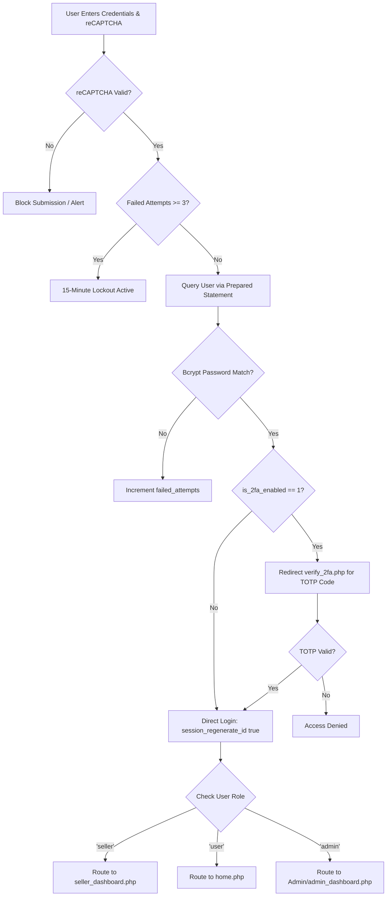
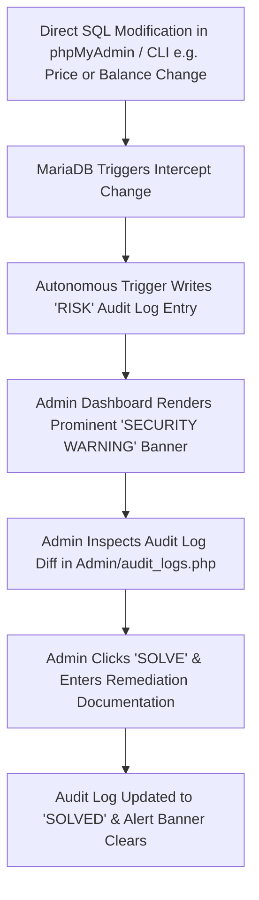

# BookWagon — Sustainable Book Rental, Resale & Swapping Platform
**Course / Subject:** Information Assurance and Security 2 (IAS 2)  
**Environment:** Apache 2.4 / PHP 8.1+ / MySQL / MariaDB (XAMPP)  
**Database Name:** `bookwagon_db`

---

## 📖 1. Project Overview

**BookWagon** is a comprehensive, multi-role web-based marketplace engineered in native PHP and MySQL designed to promote sustainable reading through book rentals with escrow protection, direct book resale, peer-to-peer (P2P) swapping, community book forums, and administrative moderation.

The platform incorporates full enterprise-grade security and assurance mechanisms aligned with **Information Assurance and Security 2 (IAS 2)** requirements, including multi-tier privilege separation, parameterized SQL execution, strict file upload validation, two-factor authentication, session fixation defenses, and autonomous database-level intrusion detection triggers.

---

## 🚀 2. Quick Setup Guide (For Evaluator / Professor)

### Step 1: Place Files in XAMPP
Extract or place the project folder into your XAMPP `htdocs` directory:
```
C:\xampp\htdocs\BookwagonNew1\
```

### Step 2: Import the Database
1. Open XAMPP Control Panel and start **Apache** and **MySQL**.
2. Open your browser and navigate to **phpMyAdmin**: [http://localhost/phpmyadmin](http://localhost/phpmyadmin).
3. Click the **Import** tab at the top.
4. Choose the clean starter database file located at:
   ```
   databases/bookwagon_db_clean.sql
   ```
   *(This script automatically creates the `bookwagon_db` database, all 31 tables, autonomous MariaDB intrusion detection triggers, sample catalog books, and pre-configured test accounts with 2FA bypassed for evaluation).*
5. Click **Import** (at the bottom).

### Step 3: Launch the Application
Open your browser and visit:
* **Marketplace / User Portal:** [http://localhost/BookwagonNew1/](http://localhost/BookwagonNew1/)
* **Administrator Portal:** [http://localhost/BookwagonNew1/Admin/](http://localhost/BookwagonNew1/Admin/)

---

## 🔑 3. Test Credentials

All accounts come pre-configured with default credentials for evaluation:

| Portal | Role | Username / Email | Password | Notes |
| :--- | :--- | :--- | :--- | :--- |
| **Admin Portal** | System Administrator | `admin` | `123456` or `123456789` | Full root access to admin dashboards, disputes, & audit logs |
| **Marketplace** | Official Seller | `seller@bookwagon.com` | `123456789` | **2FA Disabled** (Instant Login), Approved Store ("BookWagon Official Store") |
| **Marketplace** | Buyer / Student | `user@bookwagon.com` | `123456789` | **2FA Disabled** (Instant Login), Pre-loaded ₱2,500 Escrow Wallet |
| **Marketplace** | Alternate Seller | `arielfranco8868@gmail.com` | `123456` | Verified store |
| **Marketplace** | Alternate Buyer | `sss@gmail.com` | `123456` | Student buyer account |

> **Note:** The test accounts `seller@bookwagon.com` and `user@bookwagon.com` have Two-Factor Authentication turned off so they bypass email OTP verification, allowing instantaneous local login during grading and testing.

---

## 🛡️ 4. The 17 Core Security Implementations (IAS 2 Framework)

BookWagon was engineered with a comprehensive **Defense-in-Depth Security Architecture** meeting all standards for **Information Assurance and Security 2 (IAS 2)**:

### 🗄️ A. Database & Intrusion Detection
1. **100% Prepared Statements (Zero SQL Injection):** Every query in the system accepting user or external input uses parameterized prepared statements (`prepare()`, `bind_param()`, `execute()`). Concatenated SQL syntax is strictly prohibited across all endpoints.
2. **Autonomous Database Engine Triggers (Intrusion Detection System):** Database-level MariaDB triggers (`trg_audit_book_update`, `trg_audit_book_delete`, `trg_audit_user_update`) detect unauthorized direct SQL modifications (e.g. changing book prices from ₱200 to ₱500, deleting listings, or altering balances directly in phpMyAdmin).
3. **Admin Threat Alert Banner & Incident Remediation ("SOLVE" Workflow):** An integrated alert banner on `admin_dashboard.php` and `audit_logs.php` flags high-risk database anomalies. Administrators can inspect threat details, submit mitigation notes, and mark incidents as `SOLVED`.

### 🔑 B. Authentication & Identity Governance
4. **Bcrypt Password Cryptography:** Strong salted password hashing using PHP's `password_hash()` with `PASSWORD_DEFAULT` (Bcrypt) and constant-time verification with `password_verify()`.
5. **Two-Factor Authentication (2FA) via Google Authenticator (TOTP):** Implementation of RFC 6238 Time-Based One-Time Passwords with QR code provisioning and secret validation.
6. **Secondary Email OTP 2FA:** Automatic 6-digit numeric verification code delivery with time-based expiration.
7. **Single-Use Cryptographic 2FA Backup Codes:** Pre-generated recovery codes stored in hashed/JSON format, permanently burned upon use to prevent replay attacks.
8. **Account Lockout & Brute-Force Rate Limiting:** Enforces a 3-consecutive-failure threshold triggering an automatic 15-minute lockout timer (`login_attempts` session tracking).
9. **Google reCAPTCHA v2 Bot Mitigation:** Client and server-side token validation against Google's verification API on public authentication entry points.

### 🛡️ C. Session & Access Control
10. **Session Fixation Defense:** Mandatory execution of `session_regenerate_id(true)` immediately upon credential verification, 2FA validation, OAuth callbacks, and privilege changes.
11. **Inactivity Session Expiration (Idle Auto-Logout):** Automatic 10-minute (600 seconds) inactivity timer (`guest_session.php`) that terminates unattended sessions and redirects to the login screen.
12. **Role-Based Access Control (RBAC):** Strict role verification (`guest`, `user`, `seller`, `admin`) guarding sensitive endpoints against Insecure Direct Object References (IDOR) and unauthorized privilege escalation.

### 🔒 D. Application & Input Protection
13. **Defense-in-Depth File Upload Security:** Multi-layered verification for book photos and KYC IDs including server-side MIME type inspection (`finfo_open(FILEINFO_MIME_TYPE)`), extension whitelisting, 5MB size caps, randomized naming (`bin2hex(random_bytes(6))`), and safe `0644` file permissions.
14. **Cross-Site Scripting (XSS) Defense & Output Encoding:** Comprehensive sanitization and contextual escaping using `htmlspecialchars()`, `filter_var()`, and `strip_tags()` across forums, book reviews, and user profiles.
15. **CSRF & Form Request Method Validation:** Enforces strict HTTP POST method checks and data sanitization for all state-altering operations.

### 📜 E. Auditing, Forensics & Transaction Integrity
16. **Immutable Forensic Audit Trail & Device Footprinting:** Dual-layer logging recording `user_id`, remote IP address (`REMOTE_ADDR`), action type, timestamp, and device User-Agent details in `audit_logs` and `login_history`.
17. **Escrow & Double-Handshake Meetup Verification:** Financial transaction security where rental fees and security deposits are held in escrow, released only after physical QR code verification and mutual book condition photo inspection (`initial_condition_photo`).

---

## 🔄 5. End-to-End System Process Flows

### A. Authentication, 2FA & Access Control Flow
Protects user identity via reCAPTCHA v2, 3-attempt account lockout, Bcrypt password matching, optional TOTP 2FA (or direct login if disabled), session regeneration, and role-based dispatching.



### B. Book Rental, Escrow Hold & Physical Meetup Handshake Flow
Protects both renters and owners: rental fees and security deposits are placed in escrow, followed by a live photo upload and QR code scan at the physical meetup.

```mermaid
flowchart TD
    R1[Renter Selects Book & Duration in book_details.php] --> R2[Escrow Calculates Rental Fee + Security Deposit]
    R2 --> R3[Checkout: Funds Deducted from Renter Wallet into Escrow]
    R3 --> R4[Seller Prepares Book & Meets Renter On-Campus]
    R4 --> R5[Seller Uploads Live Condition Photo initial_condition_photo]
    R5 --> R6[System Generates Cryptographic Meetup QR Code]
    R6 --> R7[Renter Inspects Physical Book vs Baseline Photo]
    R7 --> R8{Condition Acceptable?}
    R8 -- Yes --> R9[Renter Scans QR Code / Enters Handshake PIN]
    R9 --> R10[Rental Activated: Status = 'active' | Countdown Starts]
    R8 -- No --> R11[Handshake Rejected: 100% Escrow Refunded to Renter]
```

### C. Book Return, Inspection & Admin Dispute Arbitration Flow
Ensures fair return processing. If damage is reported and disputed, campus administrators examine pre-handover vs post-return photos to arbitrate escrow funds.

```mermaid
flowchart TD
    Ret1[Rental Due Date Reached] --> Ret2[Parties Meet to Return Physical Book]
    Ret2 --> Ret3{Seller Inspects Return Condition}
    Ret3 -- Undamaged --> Ret4[Seller Approves Return in seller_dashboard.php]
    Ret4 --> Ret5[100% Security Deposit Returned to Renter Wallet]
    Ret5 --> Ret6[Rental Fee Credited to Seller Earnings | Book Stock Restored]
    Ret3 -- Damaged / Contested --> Ret7[Seller Flags Damage & Uploads Photo Evidence]
    Ret7 --> Ret8{Renter Concurs with Deduction?}
    Ret8 -- Yes --> Ret9[Agreed Fee Deducted from Deposit to Seller | Balance to Renter]
    Ret8 -- No --> Ret10[Escalated to Admin/admin_disputes.php]
    Ret10 --> Ret11[Admin Compares initial_condition_photo vs Return Photo]
    Ret11 --> Ret12[Admin Issues Binding Arbitration Ruling & Disburses Escrow]
```

### D. Autonomous Database Intrusion Detection & Remediation Flow
Detects direct SQL manipulation out-of-band and allows administrators to investigate and remediate threats.



---

## 📚 6. Academic & Technical Documentation Suite

Complete, in-depth academic documentation is available inside the [`bookwagon_documents/`](file:///C:/xampp/htdocs/BookwagonNew1/bookwagon_documents/) directory:

* 📄 **[Module 1: Project Overview, Problem & Solution Framework](file:///C:/xampp/htdocs/BookwagonNew1/bookwagon_documents/01_PROJECT_OVERVIEW.md)**
  * Academic Abstract, Background, Industry Problem Statement, Project Objectives, Target Stakeholders, and Tech Stack.
* 📄 **[Module 2: System Architecture & Process Flows](file:///C:/xampp/htdocs/BookwagonNew1/bookwagon_documents/02_SYSTEM_ARCHITECTURE_AND_FLOWS.md)**
  * Multi-tier defense-in-depth architecture, and 6 full Mermaid sequence & flowchart diagrams with narrative explanations.
* 📄 **[Module 3: Information Assurance & Security 2 (IAS 2) Specification](file:///C:/xampp/htdocs/BookwagonNew1/bookwagon_documents/03_SECURITY_IMPLEMENTATION_SPECIFICATION.md)**
  * Complete technical deep-dive into all **17 security implementations**, code snippets, CWE mitigations, and security controls.
* 📄 **[Module 4: Database Design, Schema & Data Dictionary](file:///C:/xampp/htdocs/BookwagonNew1/bookwagon_documents/04_DATABASE_DESIGN_AND_DICTIONARY.md)**
  * Entity-Relationship Diagram (ERD), MariaDB autonomous trigger SQL definitions, and data dictionary for all **31 tables**.

---

## 📦 7. Core Platform Modules

* **Rentals with Escrow:** Calculates weekly rental rates + security deposit held in platform escrow.
* **P2P Double-Handshake Meetup:** Seller snaps a baseline condition photo (`initial_condition_photo`), buyer scans QR code to verify condition, and transaction locks.
* **Return Inspection & Damage Arbitration:** Sellers inspect returned books; damages can be settled or arbitrated by administrators via `Admin/admin_disputes.php` or `Admin/admin_rentals.php`.
* **Book Swapping:** Direct reader-to-reader barter system with proposal management.
* **Community Forums & Book Buddies:** Discussion threads with nested comments, likes, and reader matchmaking.
* **Dual-Role Switching:** Approved sellers can switch between User Mode and Seller Mode directly from the top navigation.

