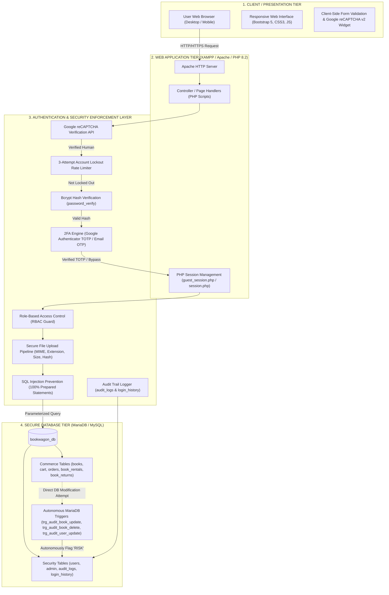
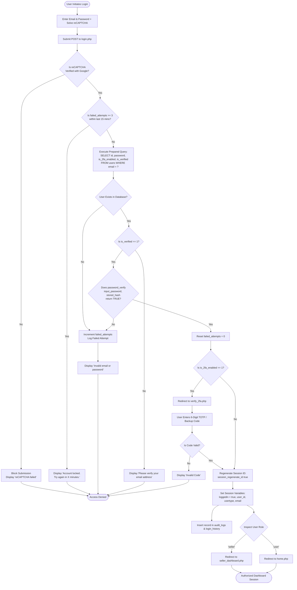
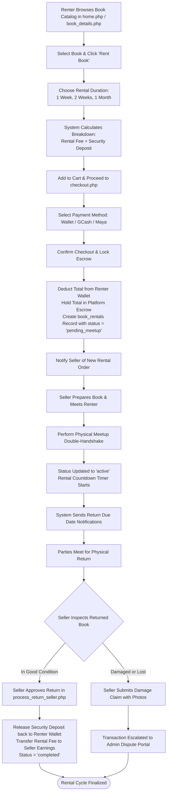
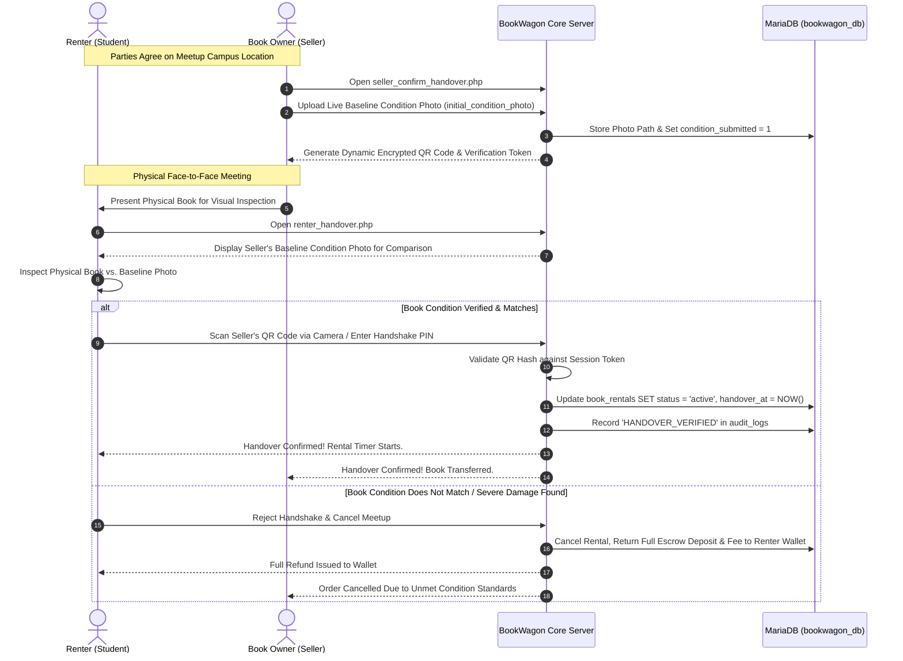
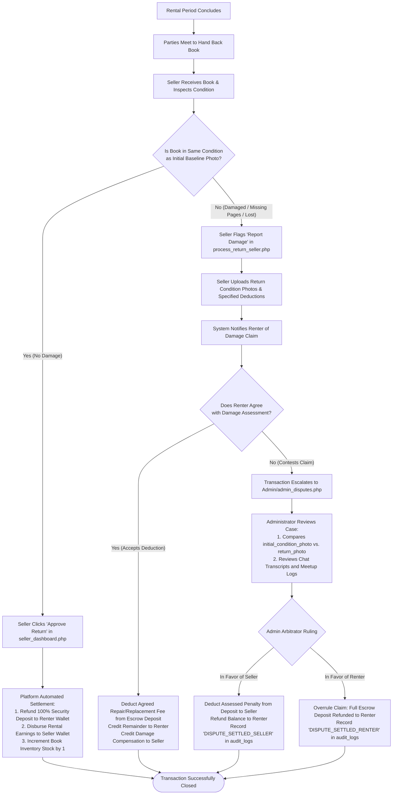
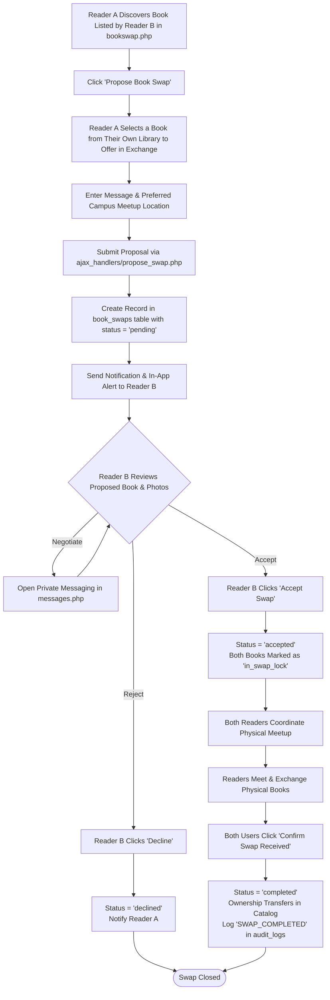

# BookWagon: System Architecture, Workflows & Process Flows
### A Secure Web-Based Platform for Sustainable Book Rental, Resale, and Barter
**Course:** Information Assurance and Security 2 (IAS 2)  
**Academic Project Document:** Module 2 — Multi-Tier System Architecture and Comprehensive Process Flows

---

## 1. Multi-Tier Defense-in-Depth Architecture

BookWagon implements a **Defense-in-Depth Multi-Tier Web Architecture**. Every user action passes through strict validation, cryptographic verification, session hardening, and database integrity checks before records are committed to persistent storage.

---

## 2. Core System Process Flows

### Flow 1: User Registration & Authentication Flow

This workflow illustrates how users safely register and authenticate, featuring Google reCAPTCHA v2 bot protection, 3-attempt account lockout, Bcrypt password verification, two-factor authentication (TOTP/OTP), session regeneration, and role dispatch.

---

### Flow 2: Book Rental & Platform Escrow Protection Flow

This workflow guarantees financial safety between renters and owners. Renter payments and refundable security deposits are held in platform escrow until books are returned safely.

---

### Flow 3: Physical Meetup "Double-Handshake" Verification Flow

To eliminate disputes over pre-existing scratches, tears, or stains, BookWagon requires a double-handshake physical meetup verification process before an item is marked handed over.

---

### Flow 4: Book Return Inspection, Damage Claims & Admin Arbitration Flow

When a rental period ends, the book must be returned. If the owner claims damage or the renter disputes the claim, BookWagon's administrative arbitration workflow acts as an impartial middleman.

---

### Flow 5: Peer-to-Peer Book Swap / Barter Proposal Flow

The BookWagon swap system allows readers to trade physical books without financial exchange.

---

### Flow 6: Autonomous Database Intrusion Detection & Incident Remediation Flow

This security mechanism detects direct out-of-band modifications made directly inside MariaDB (such as a rogue administrator, compromised DB user, or phpMyAdmin hacker altering book prices or wallet balances).

```mermaid
flowchart TD
    Intruder[Malicious Actor or Direct Database User] --> DirectSQL[Executes Direct Raw SQL in phpMyAdmin / CLI:<br/>e.g., UPDATE books SET price = 500 WHERE id = 10;<br/>OR UPDATE users SET wallet_balance = 50000;]
    
    DirectSQL --> MariaDBEngine[MariaDB SQL Engine Processes Command]
    MariaDBEngine --> TriggerFires{Does Table Have an<br/>Autonomous Security Trigger?<br/>trg_audit_book_update<br/>trg_audit_user_update}
    
    TriggerFires -- Yes --> CheckSessionSource{Was Query Generated by<br/>Application Web Session?}
    CheckSessionSource -- No (Out-of-Band Direct Modification) --> EngineAlert[Trigger Intercepts Old & New Values]
    
    EngineAlert --> InsertRiskLog[Trigger Autonomously Inserts Record into audit_logs:<br/>activity = 'UNAUTHORIZED_DATA_MODIFICATION'<br/>status = 'RISK'<br/>details = 'Price altered from 200.00 to 500.00 directly on DB']
    
    InsertRiskLog --> AdminPortal[Admin Logs into admin_dashboard.php]
    AdminPortal --> DetectRiskBanner{Are There Unresolved<br/>RISK Records in audit_logs?}
    
    DetectRiskBanner -- Yes --> ShowRedBanner[Display Urgent Red 'SECURITY WARNING' Banner<br/>Highlighting Detected Anomalies]
    ShowRedBanner --> OpenAuditLogs[Admin Clicks Banner to Open Admin/audit_logs.php]
    
    OpenAuditLogs --> ReviewThreat[Admin Inspects Forensic Details & Compares Diff]
    ReviewThreat --> OpenSolveModal[Admin Clicks 'SOLVE' Button]
    OpenSolveModal --> EnterRemediation[Admin Inputs Mitigation Notes:<br/>e.g. 'Reverted malicious price inflation; inspected credentials']
    
    EnterRemediation --> SubmitSolve[Submit Remediation Form]
    SubmitSolve --> UpdateAuditRecord[Update Record SET status = 'SOLVED', resolution_notes = ?]
    UpdateAuditRecord --> ClearBanner[Security Banner Automatically Disappears]
    ClearBanner --> SystemSecure([System State Restored to Normal])
```

