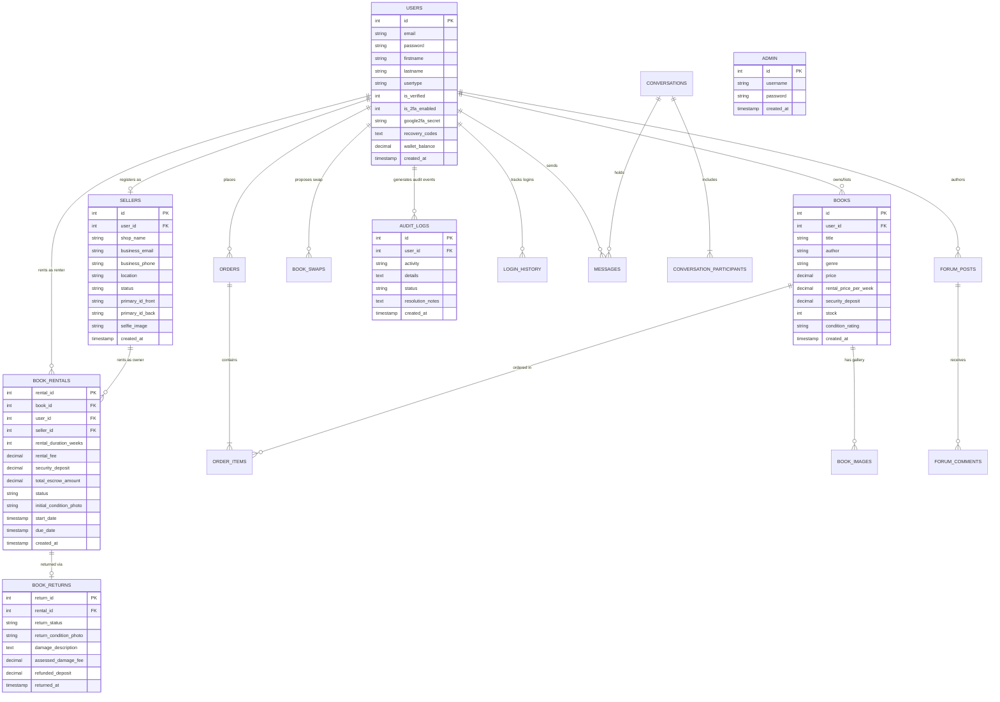

# BookWagon: Database Design, Schema & Data Dictionary
### Complete Relational Structure of the 31 Database Tables
**Course:** Information Assurance and Security 2 (IAS 2)  
**Academic Project Document:** Module 4 — Entity-Relationship Design, Triggers, and Table Dictionary

---

## 1. Relational Database Overview

The BookWagon database (`bookwagon_db`) consists of **31 relational tables** organized into five core functional clusters:
1. **Security & Identity Governance:** `users`, `admin`, `audit_logs`, `login_history`
2. **Catalog & Inventory:** `books`, `book_images`, `book_collections`, `user_favorites`
3. **Commerce, Escrow & Rentals:** `cart`, `orders`, `order_items`, `book_rentals`, `book_returns`, `payment_logs`
4. **Seller Management & Payouts:** `sellers`, `bank_accounts`, `seller_payouts`, `wallet_withdrawals`, `delivery_methods`
5. **Community, Swapping & Communications:** `book_swaps`, `swap_requests`, `swap_logistics`, `conversations`, `conversation_participants`, `messages`, `notifications`, `book_buddies`, `forum_categories`, `forum_posts`, `forum_comments`, `forum_user_interactions`

---

## 2. Entity-Relationship Diagram (ERD)



---

## 3. Autonomous MariaDB Security Triggers

BookWagon enforces engine-level security triggers in MariaDB that act as an **Autonomous Intrusion Detection System (IDS)**:

```sql
-- Trigger 1: Autonomous Book Update Tampering Detector
CREATE TRIGGER trg_audit_book_update
AFTER UPDATE ON books
FOR EACH ROW
BEGIN
    IF OLD.price <> NEW.price THEN
        INSERT INTO audit_logs (user_id, activity, details, status)
        VALUES (
            COALESCE(@app_current_user_id, 1),
            'UNAUTHORIZED_PRICE_MODIFICATION',
            CONCAT('Direct DB price change on Book #', NEW.id, ' from ', OLD.price, ' to ', NEW.price),
            'RISK'
        );
    END IF;
END;

-- Trigger 2: Autonomous Book Deletion Tampering Detector
CREATE TRIGGER trg_audit_book_delete
AFTER DELETE ON books
FOR EACH ROW
BEGIN
    INSERT INTO audit_logs (user_id, activity, details, status)
    VALUES (
        COALESCE(@app_current_user_id, 1),
        'UNAUTHORIZED_BOOK_DELETION',
        CONCAT('Direct DB deletion of Book #', OLD.id, ' titled: ', OLD.title),
        'RISK'
    );
END;

-- Trigger 3: Autonomous User Wallet / Privilege Tampering Detector
CREATE TRIGGER trg_audit_user_update
AFTER UPDATE ON users
FOR EACH ROW
BEGIN
    IF OLD.wallet_balance <> NEW.wallet_balance THEN
        INSERT INTO audit_logs (user_id, activity, details, status)
        VALUES (
            COALESCE(@app_current_user_id, 1),
            'UNAUTHORIZED_WALLET_MANIPULATION',
            CONCAT('Direct DB wallet alteration on User #', NEW.id, ' from ', OLD.wallet_balance, ' to ', NEW.wallet_balance),
            'RISK'
        );
    END IF;
END;
```

---

## 4. Complete Data Dictionary (31 Tables)

| # | Table Name | Purpose & IAS 2 Role | Primary Key | Key Foreign Keys |
| :---: | :--- | :--- | :--- | :--- |
| **1** | `admin` | Administrative root credentials and system governance | `id` | None |
| **2** | `audit_logs` | Immutable forensic audit trail, anomaly detection, threat status (`RISK`/`SOLVED`) | `id` | `user_id` ➔ `users(id)` |
| **3** | `bank_accounts` | Seller financial payout accounts and billing references | `id` | `user_id` ➔ `users(id)` |
| **4** | `book_buddies` | Peer reader connections and literary matching | `id` | `user_id` ➔ `users(id)`, `buddy_id` ➔ `users(id)` |
| **5** | `book_collections` | User-curated reading lists and academic reference sets | `id` | `user_id` ➔ `users(id)` |
| **6** | `book_images` | Gallery photos and condition snapshots for listed books | `id` | `book_id` ➔ `books(id)` |
| **7** | `book_rentals` | Rental transaction contracts, duration, escrow deposits, meetup status | `rental_id` | `book_id` ➔ `books(id)`, `user_id` ➔ `users(id)`, `seller_id` ➔ `sellers(id)` |
| **8** | `book_returns` | Return inspection reports, damage evidence, deposit refund amounts | `return_id` | `rental_id` ➔ `book_rentals(rental_id)` |
| **9** | `book_swaps` | Direct book-for-book barter proposals and exchange states | `swap_id` | `initiator_id` ➔ `users(id)`, `receiver_id` ➔ `users(id)` |
| **10** | `books` | Master inventory, condition ratings, resale prices, rental rates | `id` | `user_id` ➔ `users(id)` |
| **11** | `cart` | Ephemeral user shopping cart for rentals and purchases | `id` | `user_id` ➔ `users(id)`, `book_id` ➔ `books(id)` |
| **12** | `conversation_participants` | Multi-user session mapping for internal communication | `id` | `conversation_id` ➔ `conversations(id)`, `user_id` ➔ `users(id)` |
| **13** | `conversations` | Private chat thread channels between buyers, sellers, and swap partners | `id` | None |
| **14** | `delivery_methods` | Supported fulfillment options (P2P Campus Meetup, Courier) | `id` | None |
| **15** | `forum_categories` | Categorized boards for community book discussions | `id` | None |
| **16** | `forum_comments` | Threaded comments, responses, and discussions | `id` | `post_id` ➔ `forum_posts(id)`, `user_id` ➔ `users(id)` |
| **17** | `forum_posts` | User-created reviews, book recommendations, and threads | `id` | `user_id` ➔ `users(id)`, `category_id` ➔ `forum_categories(id)` |
| **18** | `forum_user_interactions` | User engagement tracking (likes, bookmarks, upvotes) | `id` | `post_id` ➔ `forum_posts(id)`, `user_id` ➔ `users(id)` |
| **19** | `login_history` | Forensic client tracking (IP address, User-Agent, success/failure) | `id` | `user_id` ➔ `users(id)` |
| **20** | `messages` | Internal sanitized message content between users | `id` | `conversation_id` ➔ `conversations(id)`, `sender_id` ➔ `users(id)` |
| **21** | `notifications` | In-app alerts for rentals, due dates, dispute updates, swap requests | `id` | `user_id` ➔ `users(id)` |
| **22** | `order_items` | Line-item order breakdown and historical book snapshot prices | `id` | `order_id` ➔ `orders(id)`, `book_id` ➔ `books(id)` |
| **23** | `orders` | Completed checkout orders, payment references, and escrow totals | `id` | `user_id` ➔ `users(id)` |
| **24** | `payment_logs` | Financial ledger and proof-of-payment records | `id` | `order_id` ➔ `orders(id)`, `user_id` ➔ `users(id)` |
| **25** | `seller_payouts` | Seller wallet disbursement requests and admin authorizations | `id` | `seller_id` ➔ `sellers(id)` |
| **26** | `sellers` | Store identity, KYC identification images, verification status | `id` | `user_id` ➔ `users(id)` |
| **27** | `swap_logistics` | Swap meetup location, time, and exchange confirmation details | `id` | `swap_id` ➔ `book_swaps(swap_id)` |
| **28** | `swap_requests` | Historical barter request negotiation logs | `id` | `user_id` ➔ `users(id)` |
| **29** | `user_favorites` | Wishlists and bookmarked literary catalog items | `id` | `user_id` ➔ `users(id)`, `book_id` ➔ `books(id)` |
| **30** | `users` | User credentials (Bcrypt), 2FA TOTP secret, recovery codes, wallet | `id` | None |
| **31** | `wallet_withdrawals` | Cash-out audit ledger for seller earnings via GCash / Maya | `id` | `user_id` ➔ `users(id)` |
